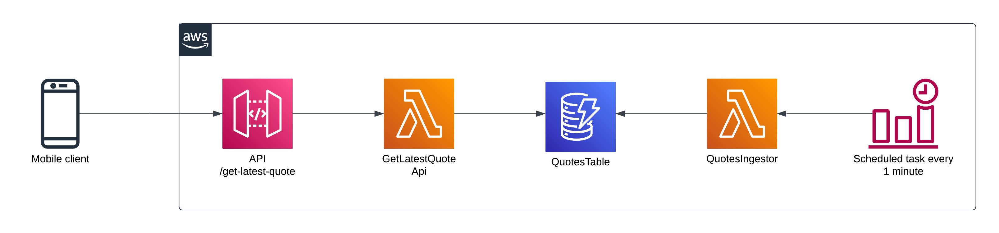

# application-composer-quotes-api-demo

This is a demo repository for a simple API service that returns motivational quotes. 
The entire service has been composed using AWS Application Composer and is deployed using AWS SAM.

## Architecture


## API
The API has a single endpoint that returns the latest ingested quote from the database along with the ingestion timestamp.
The endpoint is available at `https://<api-id>.execute-api.<region>.amazonaws.com/Prod/get-latest-quote`

The response is a JSON object with the following structure:
```json
{
    "quote": "The best way to predict the future is to create it.",
    "timestamp": "1681665388454"
}
```

## Ingestion
The ingestion process is triggered by an EventBridge rule that is scheduled to run every 1 minute.
It triggers a Lambda function that fetches a random quote from a static
list of quotes and inserts it into a DynamoDB table. 

## Deployment
The service can be deployed using the following command:
```bash
cd src/api && npm ci
cd src/ingestion && npm ci
cd ../..

sam build
sam deploy --guided
```

## Stack overview
* TypeScript
* AWS SAM
* AWS CloudFormation
* AWS API Gateway
* AWS DynamoDB
* AWS Lambda (`nodejs18.x`)
* AWS EventBridge
* AWS CloudWatch
